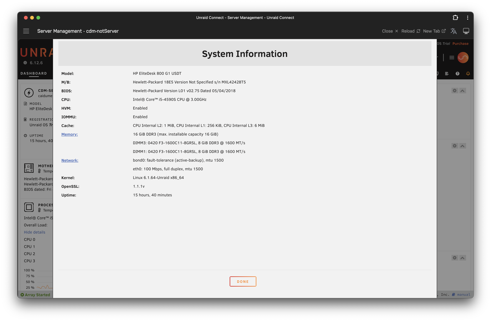

# YouTube subscriptions export / import 📺

## Just need the link? Right here!

[https://docs.google.com/spreadsheets/d/1C9M0yVJ1U2ZAabFZ4cxBwxityV-7LtNHG0HAmfMrSkw/copy](https://docs.google.com/spreadsheets/d/1C9M0yVJ1U2ZAabFZ4cxBwxityV-7LtNHG0HAmfMrSkw/copy)

## How to use the sheet?

1. Copy the sheet by go to the link above.
2. Share the sheet to your other account.
3. On your old account: click on **YouTube Subscription** - **List**.
4. Do all the authentication stuff.
5. On your new account: click on **YouTube Subscription** - **Subscribe**.
6. Again, do all the authentication stuff.
7. Profit!

## Problem

YouTube have recently removed channel exporting feature \(or something like that, once we can use the exported XML file to import to other account by using another 3rd tool\).

Luckily, the [**YouTube Data API**](https://developers.google.com/youtube/v3/docs/subscriptions) is still there, and we can use them in combine with [**Google App Script**](https://developers.google.com/apps-script/advanced/youtube) within Google Sheet to export and import subscriptions from one account to another.

## Why Google Sheet?

Well, because they has **Google App Script** - a very capable scripting platform that heavily integrated with **almost all Google services**. **The most important thing for me is a don't have to deal with the OAuth things.**




 I'm still working on Playlist and honestly I don't feel like I need to, so... please ignore the PLAYLIST sheet atm.


Here you can get a glimpse of the code:


```bash
var ui = SpreadsheetApp.getUi();
var ss = SpreadsheetApp.getActiveSpreadsheet();
var sheet = ss.getActiveSheet();
var rangeData = sheet.getDataRange();
var lastColumn = rangeData.getLastColumn();
var lastRow = rangeData.getLastRow();

var r = 1;

function onOpen() {
  ui.createMenu("YouTube Subscription")
    .addItem("List", "listSubscription")
    .addItem("Subcribe", "addSubscription")
    .addToUi();
}

function listSubscription() {
  var resource = {
      "maxResults": 1000,
      "mine": true
    };

  try {
    var response = YouTube.Subscriptions.list('snippet', resource);
    // Logger.log(response);
    items = response.items;
    var i = 0;
    for (i; i < items.length; i++){
      channelId = items[i].snippet.resourceId.channelId;
      title = items[i].snippet.title;
      sheet.getRange(i+2,1).setValue(title);
      sheet.getRange(i+2,2).setValue(channelId);
    }
  } catch (e) {
    if (e.message.match('subscriberNotFound')) {
      Logger.log('The subscriber identified with the request cannot be found!');
    } else {
      Logger.log('Error listing subscription: ' + e.message);
    }
  }

}

function addSubscription() {
  // Replace this channel ID with the channel ID you want to subscribe to
  var i=2;
  var channelId;
  
  for (i; i <= lastRow; i++) {
    channelId = sheet.getRange(i,2).getValue()

    var resource = {
      snippet: {
        resourceId: {
          kind: 'youtube#channel',
          channelId: channelId
        }
      }
    };

    try {
      var response = YouTube.Subscriptions.insert(resource, 'snippet');
      Logger.log(response);
      sheet.getRange(i,3).setValue('TRUE');
    } catch (e) {
      sheet.getRange(i,3).setValue('FALSE');
      if (e.message.match('subscriptionDuplicate')) {
        Logger.log('Cannot subscribe; already subscribed to channel: ' +
            channelId);
      } else {
        Logger.log('Error adding subscription: ' + e.message);
      }
    }
  }

}

```


